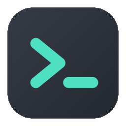

<p align="center">
  
</p>

<h1 align="center">ztabb</h1>

<p align="center">
  A fast, lightweight terminal: one native process, a bundled typeface,<br>
  and no runtime to feed. macOS, Linux and Windows.
</p>

Tabs and panes, a VT/xterm emulator, hosts read from `~/.ssh/config`, light and
dark themes, and syntax colouring on the line you are typing.

## What it costs

Measured on an Apple Silicon Mac, against Tabby running beside it:

|                    | ztabb          | Tabby               |
| ------------------ | -------------- | ------------------- |
| Idle CPU           | **0.1 %**      | 14.3 %              |
| Resident memory    | **110 MB**     | 459 MB              |
| Processes          | **1**          | 5                   |
| On disk            | **8.6 MB**     | 379 MB              |
| Runtime dependency | **SDL3, libc** | Electron / Chromium |

Two honest caveats. Tabby was a live instance with tabs open, not a controlled
baseline — treat it as an order of magnitude, not a benchmark. And most of
ztabb's 110 MB is not ztabb: an empty SDL window with a Metal renderer already
costs 88 MB on this machine. ztabb's own share is about 23 MB, of which the font
atlases on the GPU are the bulk.

What ztabb itself holds is small and bounded:

- **16 bytes** per screen cell.
- **63 KB** for a fresh 120x34 tab — scrollback is not reserved until something
  scrolls.
- **4 MB** ceiling on a tab's history, whatever it is fed.
- **Zero** allocations in the render loop.

## Licence

ztabb is MIT — see `LICENSE` — with one exception.

`src/font.dat` and `src/font_data.zig` hold glyph data rasterized from
**JetBrains Mono**. That makes them a Modified Version of the font, and OFL
clause 5 requires the Font Software to be distributed *entirely* under the OFL
and under no other licence. So those two files, and the glyph data compiled from
them into the binary, are **OFL 1.1, not MIT**; everything else is MIT.

Bundling is what clause 2 allows, on condition every copy carries the licence,
which is why `licenses/JetBrainsMono-OFL.txt` ships in the repository and again
inside `ztabb.app`. `NOTICE` spells out how each clause is met.

## Download

Zig and a build step are not needed to run ztabb. The installer picks the
release built for your machine, checks it against the published SHA-256, and
puts it where the platform expects it:

```sh
curl -fsSL https://raw.githubusercontent.com/alaleks/ztabb/master/install.sh | sh
```

It reads two variables: `ZTABB_VERSION` to pin a tag rather than take the
latest, and `ZTABB_PREFIX` to install somewhere other than `/Applications` on
macOS or `/usr/local` on Linux.

Or take the file for your machine by hand, from the
[latest release](https://github.com/alaleks/ztabb/releases/latest):

| File                        | For                                          |
| --------------------------- | -------------------------------------------- |
| `ztabb-aarch64-macos.zip`   | macOS, Apple Silicon — a ready `ztabb.app`    |
| `ztabb-x86_64-macos.zip`    | macOS, Intel — a ready `ztabb.app`            |
| `ztabb-x86_64-linux.tar.gz` | Linux x86_64 — the binary and its licences    |

`checksums.txt` beside them holds the SHA-256 of each file.

**macOS.** Unzip and move `ztabb.app` to `/Applications`. The bundle carries its
own copy of SDL3, so there is nothing else to install. It is ad-hoc signed
rather than signed with a Developer ID, so a downloaded copy arrives
quarantined: on first launch either right-click the app and choose **Open**, or
clear the flag first. (The installer above does this for you.)

```sh
xattr -dr com.apple.quarantine /Applications/ztabb.app
```

**Linux.** The tarball holds the binary and the licences; SDL3 comes from the
system, since the release links against it (`libsdl3-0`, `sdl3`, or whatever the
distribution calls the runtime — `tools/install-sdl3-linux.sh` will fetch it).

There is no Windows release yet. It builds and its tests run in CI, but no
binary is published, so Windows means building from source for now.

Building it yourself is worth it only if you want to change something, or want a
macOS app that is not quarantined — the rest of this section is for that.

## Requirements

- Zig 0.16.0
- SDL3 (`brew install sdl3`)

## Build

```sh
zig build                       # build
zig build run                   # build and run
zig build test                  # 386 unit tests
zig build -Doptimize=ReleaseFast

zig build bundle                # zig-out/ztabb.app, with its icon (macOS)
```

`zig build bundle` is macOS-only: it is what puts the icon in the Dock, Finder
and Launchpad, since macOS shows an application icon for a bundle and a bare
executable borrows the terminal's.

On Linux, install SDL3 (`tools/install-sdl3-linux.sh` does it from the package
manager or from source) and `zig build`. On Windows, `vcpkg install
sdl3:x64-windows` and `zig build -Dsdl3=<vcpkg>/installed/x64-windows`.

## Install (macOS)

```sh
zig build bundle -Doptimize=ReleaseFast
cp -R zig-out/ztabb.app /Applications/
```

The bundle carries its own copy of SDL3 and is ad-hoc signed, so the installed
app keeps working if Homebrew's formula is upgraded or removed. It is not
signed with a Developer ID; a locally built app is not quarantined, so it opens
without Gatekeeper asking, but a copy downloaded from elsewhere would be.

## Keys

The application modifier is **Cmd** or **Ctrl+Shift** — both work everywhere, so
there is a second option where the system claims a Cmd combination for itself.
Plain Ctrl belongs entirely to the shell, so Ctrl+C, Ctrl+W and Ctrl+R behave as
they always do.

| Key                               | Action                               |
| --------------------------------- | ------------------------------------ |
| `Cmd+T` / `Cmd+N`                 | New tab                              |
| `Cmd+D` / `Cmd+E`                 | Split the pane right / down          |
| `Cmd+←` `→` `↑` `↓`               | Move focus between panes             |
| `Cmd+W`                           | Close pane, and the tab with the last |
| `Cmd+1` … `Cmd+9`                 | Go to tab by number                  |
| `Cmd+[` / `Cmd+]`                 | Previous / next tab                  |
| `Cmd+S`                           | SSH host list                        |
| `Cmd+Y`                           | Toggle light / dark                  |
| `Cmd+L`                           | Toggle command colouring             |
| `Cmd+=` / `Cmd+-` / `Cmd+0`       | Font size: up / down / back to 13 pt |
| `Cmd+C` / `Cmd+V`                 | Copy selection / paste               |
| `Shift+PageUp` / `Shift+PageDown` | Scroll history                       |
| Mouse wheel                       | Scroll (see below)                   |

No binding uses Shift as an extra modifier: under the Ctrl+Shift form it is
already spoken for, and such a combination would be unreachable there.

**Ctrl+C** copies when something is selected and interrupts when nothing is —
in a terminal Ctrl+C is the interrupt and cannot simply become copy, but with a
selection on screen that is plainly what was meant. **Ctrl+V** stays the shell's
`quoted-insert`; paste is `Cmd+V` or `Ctrl+Shift+V`.

Copying with nothing selected says so rather than copying something else. It
used to fall back to the cursor's line, which meant the clipboard quietly
filled with the prompt and the next paste inserted that.

The wheel does whatever suits what is running. With a shell at a prompt it
moves through the history. On the alternate screen — `nano`, `vim`, `less` —
there is no history to move through, because the program is drawing the whole
window, so the wheel is sent as the arrow keys it would otherwise have got. And
a program that has asked for the mouse itself receives the wheel and the clicks
as events, in whichever encoding it negotiated. Holding **Shift** takes the
mouse back for selection while such a program has it.

**Right-click** over the terminal opens a menu: copy, paste, split the pane
right or down, close it. Items that would do nothing — copy with no selection —
are dimmed rather than hidden, so the menu keeps its shape.

Clicking a pane focuses it. Mouse: **+** opens a tab, the globe beside it drops down the SSH hosts, a click
selects a tab, **×** closes one. Dragging over the terminal selects a range;
`Cmd+C` copies it, falling back to the cursor's line when nothing is selected.
Typing or switching tabs clears the selection, so what is highlighted is always
what would be copied.

Pasting honours **bracketed paste**: when the program has asked for it, the text
arrives wrapped in markers, so a shell can tell it from typing and will not run
a pasted command until Enter.

`ZTABB_THEME=light ztabb` opens in the light theme.

## Why it is small

**One process, no web stack.** The renderer is SDL3 talking to Metal; there is
no browser engine, no JavaScript runtime and no IPC between helper processes.
The binary links against SDL3 and libc, and nothing else.

**Glyphs are batched by colour.** A colour change flushes SDL's batch, and
setting one per glyph cost 9800 flushes a frame on a full window of ordinary
single-colour output, where 49 suffice. Runs sharing a colour and weight are
drawn together.

**Frames are drawn only when something changed**, and the poll interval backs
off while nothing does — which is why an idle window costs a tenth of a percent
of a core rather than sixty redraws a second of a motionless prompt. A keystroke
wakes it immediately.

**A typed character lands in the frame it was typed in.** After a key press the
loop waits briefly for the shell's echo before drawing, rather than showing it a
frame later.

**History is bounded by bytes, not just rows.** A row cap alone does not hold:
on a wide window every row is expensive, so a tab left on `tail -f` would keep
tens of megabytes for the session. At the ceiling the ring evicts its oldest row
one at a time, so scrollback depth stays constant instead of collapsing by half
periodically. On a 200x50 window the history settles at 4 MB after about five
thousand lines and stays there through half a million.

**Nothing is allocated per frame.** The SSH list, the labels and the highlighter
all work in fixed buffers.

## Panes

A tab holds a binary tree: every leaf is a pane with its own shell, every
branch splits its area in two. Splitting the focused pane replaces that leaf
with a branch, so a layout can grow in any shape rather than only in rows or
only in columns — split right, then split the right half downwards, and the
left pane keeps its full height.

Focus moves by direction, decided on the laid-out rectangles rather than by
walking the tree: the question being asked is "what is over there", and
geometry answers it however the splits happen to nest. Each pane has its own
pty, history and scrollback position, and a split that would leave a pane too
small to read a prompt in is refused rather than made.

## The terminal

The escape parser is a state machine, so a sequence or a UTF-8 code point split
across a pty read is reassembled rather than mangled. Cursor movement, ED/EL,
insert and delete of lines and characters, scrolling regions (DECSTBM), the
alternate screen (`vim`, `less`, `htop`), DECTCEM, DECSC/DECRC, window title via
OSC 0/1/2, SGR attributes, 256 colours and truecolor.

**Resizing re-wraps.** A line that only broke because the window was narrow is
one logical line, and changing the width — by dragging the window or by
stepping the font size — lays it out again at the new one instead of leaving
old output boxed into the column count it happened to be printed at. History
is re-wrapped with the screen, the cursor is followed to where its text moved
to, and a taller window pulls rows back out of the scrollback rather than
padding the bottom with blanks. The alternate screen is exempt: `vim` and
`htop` redraw on their own when they hear the new size.

## The typeface

**JetBrains Mono is built in** — 1067 glyphs, no installation and no font
library. Glyphs live in the executable as antialiased coverage maps, and the
binary links no font machinery at all.

Default size is 13 pt; `Cmd+=` and `Cmd+-` step to 11 and 16. The cell follows
the typeface's own metrics: 0.60 em wide by 1.32 em tall, the full ascent plus
descent, so descenders are not clipped. Every size is baked at 1x and again at
exactly 2x — a bitmap stretched onto a denser backbuffer loses the antialiasing
that makes small text legible.

Interface text — tab labels, dialogs — is set in the real Medium face, a step
smaller than the terminal: at that size Regular goes faint and Bold goes heavy.
It is aligned on the **cap band** rather than the cell, because the cell carries
the whole font box and the room above the capitals is not matched below, which
sets a label low beside the icon next to it.

Coverage includes Latin, Cyrillic, Latin-1, arrows, box drawing, block elements
and **Powerline** (U+E0A0–U+E0B3), so `agnoster` and `powerlevel10k` prompts
render without a Nerd Font. The separators are drawn geometrically rather than
taken from the face: only exact geometry tiles with the cells either side of it
without a seam.

## Icons

Interface icons are signed distance fields evaluated at the exact size they are
drawn, not bitmaps. Strokes are capsules, so caps and joins are round, and their
weight is matched to the interface face's stem so an icon and the label beside
it read as one piece. Being formulas rather than pictures, they are identical on
every display.

The application icon is drawn the same way: a rounded square on the terminal's
own dark ground with a hairline rim, so it does not dissolve into a dark Dock,
and a teal prompt holding 7.6:1 against it — at 16 px the mark has nothing else
helping it. macOS asks for a dozen sizes, and each is rendered at its own
resolution instead of scaled from one master.

## Themes

Light and dark in the spirit of JetBrains' Gerry: a soft blue-grey ground rather
than near-black, with muted accents. Screen cells store **palette indices**, not
resolved RGB, so switching the theme recolours text already on screen. Every
pairing is checked against WCAG in the tests; body text holds 8.8:1 and the
weakest ANSI colour 4.3:1.

## SSH

`~/.ssh/config` is parsed at startup: aliases, `HostName`, `User`, `Port`,
`IdentityFile`, several aliases on one `Host` line, the `Key=value` form, and
`Include` one level deep. Wildcards such as `Host *` are recognised but not
listed — they are defaults, not somewhere to connect.

The globe button or `Cmd+S` opens the list; arrows or the mouse choose, Enter or
a click connects, Esc closes. The chosen host is started as `ssh <alias>` in a
new tab, and the tab takes that name — the remote shell's own title does not
bury which connection it is.

Keys, the agent, `ProxyJump` and `Match` blocks are `ssh`'s business: ztabb
passes the alias and overrides nothing, so whatever works as `ssh <alias>` in
another terminal works here.

## Command colouring

The shell owns its input line, so ztabb does not touch the byte stream — it
colours cells at draw time. It finds the end of the prompt (`$ `, `% `, `# `,
`> `, `❯ `) and colours the command, builtins, options, strings, paths,
variables, operators and comments. It stands aside on the alternate screen and
while the history is scrolled.

## Layout

```
src/
├── main.zig        entry point
├── app.zig         window, event loop, key bindings
├── render.zig      grid, tab bar, overlays
├── terminal.zig    screen model and escape parser
├── pty.zig         picks the platform's pty
├── pty_posix.zig   openpty and a forked child
├── pty_windows.zig ConPTY
├── tabs.zig        tab list
├── theme.zig       light and dark palettes
├── highlight.zig   command-line lexer
├── panes.zig       how a tab is divided
├── ssh.zig         ~/.ssh/config parser
├── font.zig        baked typeface and atlas assembly
├── icons.zig       interface icons from distance fields
├── appicon.zig     application icon
├── png.zig         minimal PNG writer, for the .icns
├── macos.zig       transparent title bar (macOS only)
├── font_data.zig   generated: metrics and range table
└── font.dat        generated: 8-bit glyph coverage
tools/
├── genfont.c       typeface generator (only to re-bake it)
├── mkiconset.zig   renders the .iconset for iconutil
├── mklogo.zig      renders the README logo frames
├── install-sdl3-linux.sh  SDL3 from the package manager or source
└── bundle.sh       assembles ztabb.app
```

Every module builds and tests on its own: `zig build test` runs thirteen
independent suites.

### Regenerating the artwork

The icon and the logo are drawn by the same code, so they cannot drift apart.

```sh
zig build icon     # zig-out/ztabb.icns
zig build logo     # .github/logo.gif  (needs ffmpeg)
```

### Re-baking the typeface

Only needed to change the character set or the faces. Requires macOS (CoreText)
and JetBrains Mono installed; the result is committed, so an ordinary build
depends on neither. The generator refuses to run if the font is missing rather
than silently baking whatever CoreText substitutes.

```sh
cc -O2 -o /tmp/genfont tools/genfont.c -lm \
   -framework CoreText -framework CoreGraphics -framework CoreFoundation
/tmp/genfont                    # writes src/font.dat and src/font_data.zig
/tmp/genfont 0x41 0x2500        # dump glyphs as ASCII art
```

## Platforms

| | State |
| --- | --- |
| **macOS** | Built, run and measured here. Ships as a signed `.app`. |
| **Linux** | Builds and tests in CI. Needs SDL3 installed. |
| **Windows** | Builds and tests in CI. Needs SDL3 (`vcpkg install sdl3`). |

Nothing is written twice that does not have to be. The pty is the one place the
platforms genuinely differ: POSIX gets `openpty` and a forked child, while
Windows has neither and uses **ConPTY**, a pseudo-console driven through a pair
of pipes. Both present the same API, so the terminal, the tabs, the panes and
the renderer above them are one implementation.

Everything else takes its constants from the platform rather than assuming one:
`errno`, `O_NONBLOCK` and signal numbers differ between the BSDs and Linux, and
`~/.ssh/config` is found through `%USERPROFILE%` on Windows the way OpenSSH
finds it there. The transparent title bar is the only deliberately macOS-only
piece; elsewhere the window keeps an ordinary system title.

The `.app` bundle, its icon and the `.icns` are macOS packaging and are built
only by `zig build bundle`. On Linux and Windows `zig build` produces the
binary, and the window icon is set at runtime on every platform.

## Roadmap

- [x] ZSH and font support
- [x] Light and dark themes, switchable live
- [x] SSH connections from `~/.ssh/config`, with keys
- [x] Command syntax colouring
- [x] Powerline glyphs for `agnoster`-style prompts
- [x] Mouse tab control and icons drawn from geometry
- [x] Application icon and an `.app` bundle
- [x] JetBrains Mono at 13 pt, with size steps
- [x] Memory ceiling on a tab's history
- [x] Mouse selection and copying a range
- [x] Bracketed paste
- [x] Splitting a tab into panes
- [x] Re-wrapping the scrollback when the width changes
- [ ] Custom themes and key bindings from a config file
